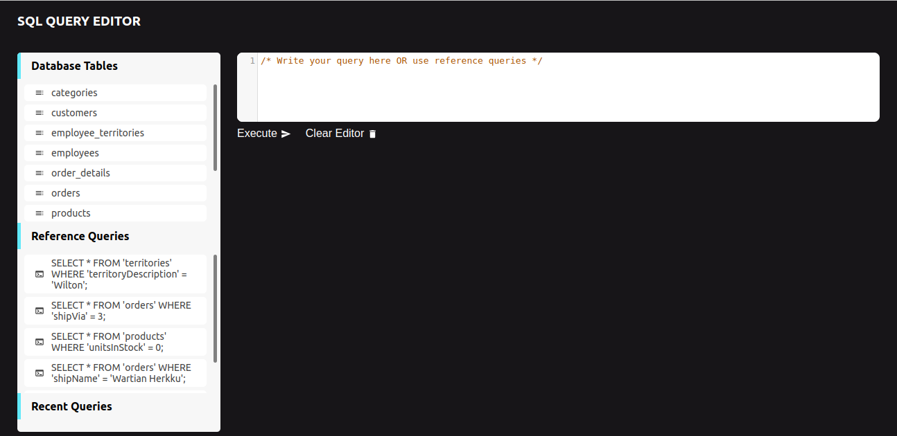
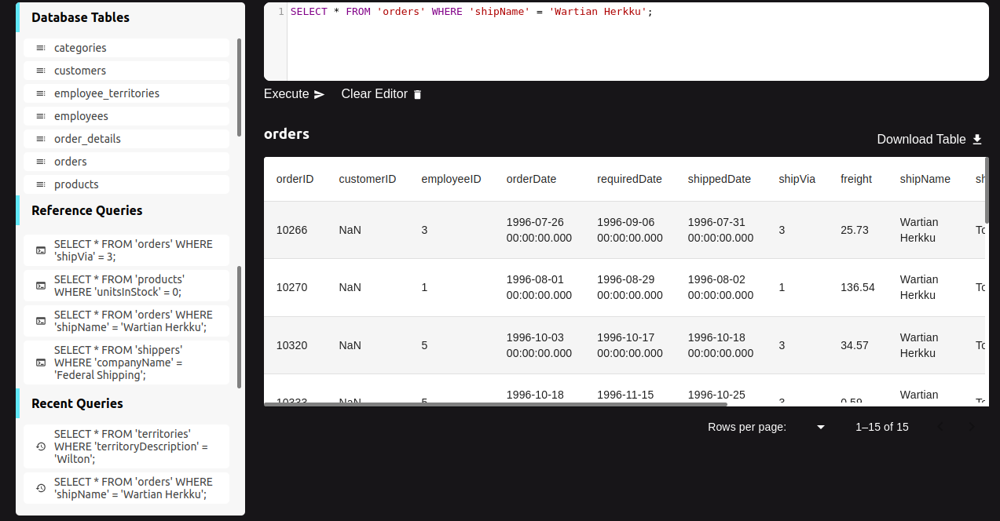

## SQL QUERY EDITOR

## 📚 Description
Create, design, and implement a web-based application capable of running SQL queries and displaying the results of said query. The application must include a space that accepts SQL queries in the form of user inputs, then runs the given query and displays the result within the application.

## 👨‍💻 Live Demo
Try out the website : [REACT SQL Editor](https://sql-editor-five.vercel.app/)

See the video explanation of the project on YouTube: 

## Packages
1. [**Material UI**](https://github.com/mui-org/material-ui): Material-UI is a popular and comprehensive UI library for React that embraces Google's Material Design principles. With a vast collection of customizable components, pre-designed layouts, and themes.
2. [**Code Mirror**](https://github.com/codemirror/CodeMirror): CodeMirror is a versatile and highly customizable code editor component for the web. It offers developers a rich set of features, including syntax highlighting, code completion, line numbering, and more.
   
## 👨‍💻 Features
:white_check_mark: Lazy Loading for Table Data: During the initial load, the application retrieves the list of available tables, deferring the actual data retrieval until the user clicks on a specific table. This approach optimizes the initial loading time, providing a user-friendly experience by fetching and displaying data only upon request.

:white_check_mark: Fully functional SQL Code editor: A key functionality of our application is enabling users to input and execute their own SQL queries. This flexibility empowers users to interact with the database using personalized commands, catering to a variety of data analysis requirements.
 
:white_check_mark: Output Table Pagination: The application implements paginated table data presentation to improve the handling of large datasets. Instead of overwhelming users with an extensive list, the data is organized into manageable pages (20 per page), enhancing readability and navigation.

:white_check_mark: Saving the already used query output as memory cache: Simplify the querying process by saving and reusing predefined queries and tables within the application. This feature boosts efficiency and minimizes the need for repetitive input.

:white_check_mark: Data Export Capability: Our application allows users to export query results in JSON format, providing a convenient way to save and share data. Additionally, the feature to save queries eliminates the need for repetitive typing, enhancing user efficiency.

:white_check_mark: Elevated User Interface and Experience: Our project focused extensively on enhancing the UI/UX for the SQL query React app. Through meticulous attention to detail, we have elevated the visual aesthetics, streamlined navigation, and optimized user interactions. The result is a sophisticated and user-friendly environment, meticulously crafted to maximize user engagement and satisfaction.

## ✍️ Predefined SQL Queries
- `SELECT * FROM 'territories' WHERE 'territoryDescription' = 'Wilton';`
- `SELECT * FROM 'orders' WHERE 'shipVia' = 3;;`
- `SELECT * FROM 'orders' WHERE 'shipVia' = 3;;`
- `SELECT * FROM 'orders' WHERE 'shipName' = 'Wartian Herkku';`
- `SELECT * FROM 'orders' WHERE 'shipName' = 'Wartian Herkku';`
- `SELECT * FROM 'shippers' WHERE 'companyName' = 'Federal Shipping';`

## ⏱ Page Load Time
Page Load time of this website on desktop is around 0.6sec.
We can check code spnappyness GTmetrix Grade.

## Laptop performance view ([web.dev Report](https://pagespeed.web.dev/))

## Mobile performance view ([web.dev Report](https://pagespeed.web.dev/))

## 🪜 Steps I took for optimization

1. Dynamic Data Retrieval: A highly efficient optimization strategy employed in our React SQL editor project revolves around dynamic fetching. This approach entails fetching table rows exclusively upon user request, mitigating unnecessary data load during the initial phase and optimizing overall application performance.

2. Memoization for Enhanced Efficiency: We have implemented a thoughtful optimization technique in the Sidebar and Table components, particularly when handling intricate calculations. Through the strategic use of memoization, we have intelligently cached the results of computationally intensive functions. This ensures that computations are executed only when inputs change, preserving valuable processing time and contributing to a more responsive and faster user interface.

3. Minimized Component Rerenders: In our relentless pursuit of superior performance, we have carefully minimized the frequency of component rerenders for elements that share static values within our React application. This meticulous approach enhances efficiency and responsiveness, contributing to an optimized user experience.

## Available Scripts

In the project directory, you can run:

### `npm install`

To install all the packages in package.json. This will install all the dependencies and devDependencies.

### `npm start`

Runs the app in the development mode.\
Open [http://localhost:3000](http://localhost:3000) to view it in the browser.

The page will reload if you make edits.\
You will also see any lint errors in the console.

### `npm run build`

Builds the app for production to the `build` folder.\
It correctly bundles React in production mode and optimizes the build for the best performance.

The build is minified, and the filenames include the hashes.\
Your app is ready to be deployed!

See the section about [deployment](https://facebook.github.io/create-react-app/docs/deployment) for more information.

## 🚀 Project Output

